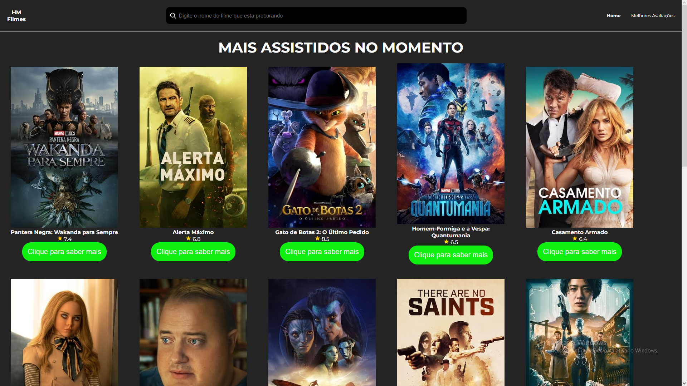
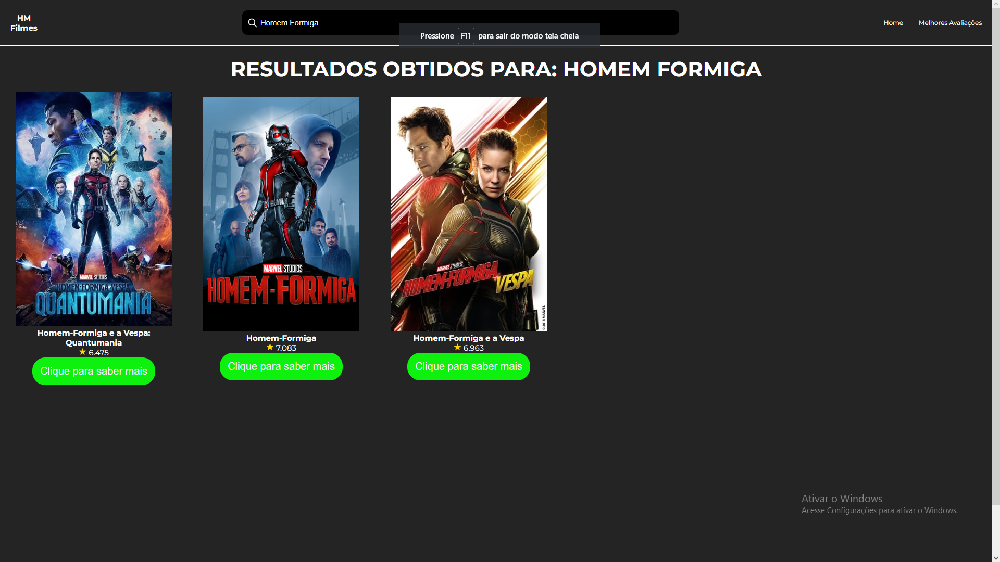
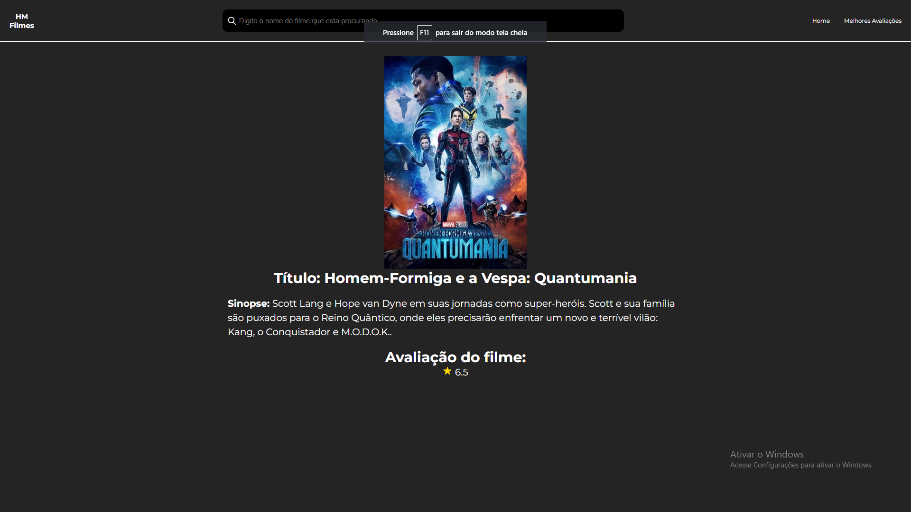
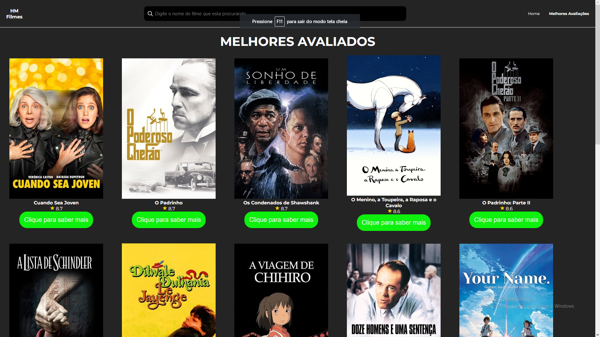

# project-movie
Projeto onde aprendi a consumir API utilizando ReactJS  
Utilizei a API do TMDB para criação do projeto.  
Lidei com React-Router, React-Hooks e consumo de API para criar esse projeto

[Site da API utilizada](https://developers.themoviedb.org/3/getting-started/introduction)

## Imagens do projeto:

### Imagem da Home:

### imagem da aba de Pesquisa:

### Imagem da aba das rotas dinâmicas:

### Imagem da aba das rotas dinâmicas:

### Tecnologias utilizadas no projeto:
* JSX
* React
* React-router-dom
* React-hooks
* CSS